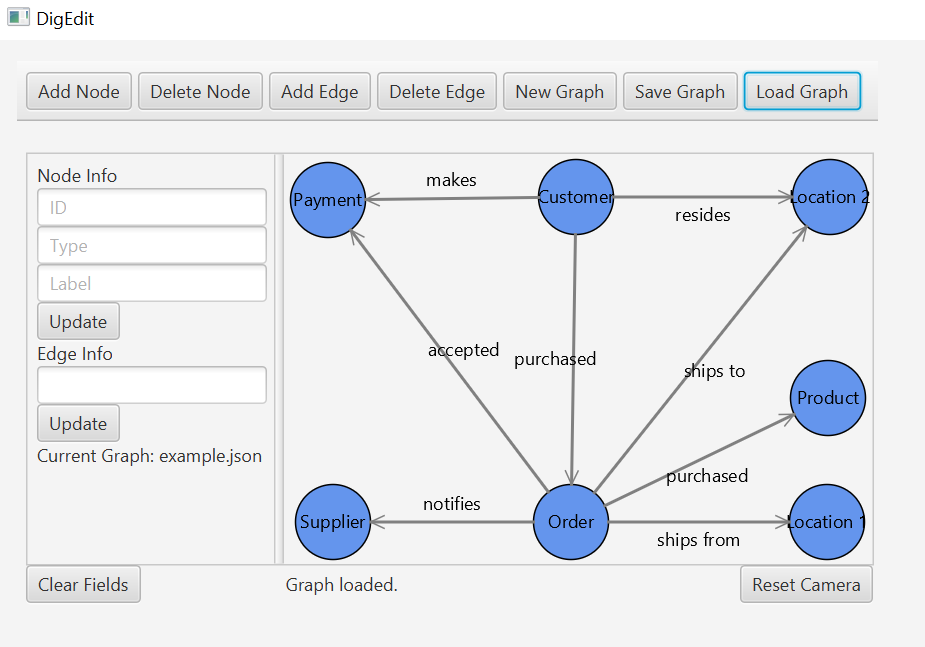

# DigEdit  
How to run the app:  
- Install Java JDK 17+  
- Install JavaFX SDK 21.0.6 (unzip the file to a simple location like C:\javafx-sdk-21.0.6)  
- Install IntelliJ IDEA Community Edition (easier to config JavaFX)  
- Install Scene Builder (not required, only utilized for GUI design)  
- Create a new project in IntelliJ, select Java project (no Gradle/Maven), name it DigEdit, and choose JDK 17+  
- Paste MainApp.java and GraphController.java into src/  
- Create a resources/ folder, right-click the folder and mark it as resources root, paste main.fxml into resources/  
- Go to File -> Project Structure, go to Libraries and click the +, add the lib/ folder containing .jar files from javafx-sdk-21.0.6  
- Go to Run -> Edit Configurations, click the + and add Application (link it to MainApp)  
- Paste this into the VM options: --module-path C:/javafx-sdk-21.0.6/lib --add-modules javafx.controls,javafx.fxml (use your JavaFX SDK path)  
- Click the green play button and run  

